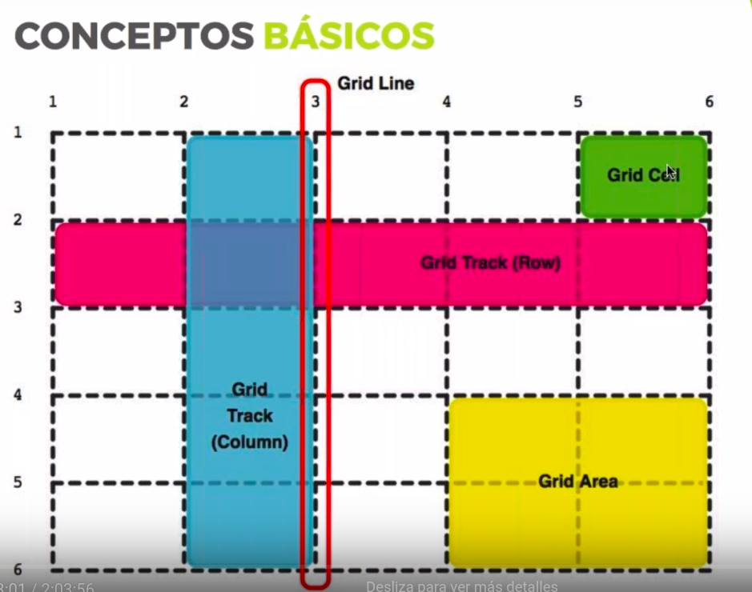

# GRID LAYOUT

## Introducción:

La definición habitual de Grid Layout, es que es un sistema de rejilla en dos dimensiones, y que se suele comparar con FlexBox que se trabaja en una dimensión. En Flex Box se les dice a los items que hacer en el eje horizontal y en el vertical, pero no se manejan ambos ejes al mismo tiempo. En ese caso los items que no caben en una linea pasan a la de abajo, lo que no quiere decir que en realidad se estén controlando.

Con Grid sí hacemos eso, tenemos el control de ambas dimensiones. Podemos determinar la posición tanto vertical como horizontal de un item.

Surgen una serie de cuestiones:

- Voy a poder colocar los items Dónde quiera, pero habrá items que se coloquen solos.
- Se puede hacer lo mismo de muchas formas, pero no todas hace exactamente lo mismo, puesto que determinadas propiedades se comportan de forma distinta si el item no tiene sitio por ejemplo.
- Controlar las 2 dimensiones, no es Flexbox.
la colocación de los items es muy libre, no es una tabla al uso. 
- Tiene una sintaxis muy extensa.
- Es un poco locura controlar bien Grid, pero va a cambiar el css para siempre.

¿Se puede usar con cualquier framework?
En principio sí, porque es una especificación de CSS.


## Conceptos básicos:




La base de Grid son las líneas, horizontales para las filas, y verticales para las columnas. Comienzan en la linea 1.

El espacio entre dos líneas es track, es decir, el espacio entre dos líneas horizontales son las filas, y el tack entre dos líneas verticales una columna. 

Una celda es el espacio delimitado por 4 lineas. 

Un area es un espacio en el que hay varias celdas.

Se puede combinar sin problema con flexbox.

A la hora de tener un diseño delante tenemos que empezar a saber perféctamente donde aplicar el grid y dónde el flexbox.

El grid area tiene que tener una base y una altura, es decir rectangular o cuadrado. 

Se pueden montar grids dentro de otros sin problema.


## La propiedad *display: grid*:

En el momento que ponemos en la propiedad *display* formato grid, pasa a ser un grid:
```css
body {
    display: grid;
}
.main {
    display: inline-grid; 
}
```
Y sus **hijos directos**  pasan a ser **grid items**


## Definiendo tracks:

Hay que crear el grid explícitamente, diciéndole cuantas tracks va a tener horizontal y verticalmente. Hay muchas sintaxis para hacer esto, pero vamos a ver las más comunes. 

En este caso iremos al ejemplo 2. A parte de poner ```display: grid``` hay que especificar concretamente el número de filas y columnas con las siguientes propiedades:

```css
.grid {
    display: grid;
    grid-template-columns: 200px 200px 200px; /* expecifíca la cantidad de tracks verticales (columnas) y su ancho */
    grid-template-rows: 150px 150px 150px 150px; /* expecifica la cantidad de tracks horizontales (filas) y su alto */
}
```

Para poder separar los diferentes tracks tanto vertical como horizontalmente, tenemos la propiedad *gap* que será especificada tanto horizontal como verticalmente (no puede usarse la unidad fr en el gap, puesto que fr es la porción del espacio útil, y si no se determina este espacio, no se puede realizar el cálculo):

```css
.grid {
    display: grid;
    grid-template-columns: 200px 200px 200px; 
    grid-template-rows: 150px 150px 150px 150px; 
    grid-column-gap: 1rem; /* Espacios entre track verticales */
    grid-row-gap: .5rem;
}
```

## La unidad *fr*. Haciendo flexibles las celdas:

Introducimos ahora el concepto de *fr* que significa *fraction unit*. Con esta unidad, lo que hacemos es decirle que cada track ocupe una fracción (o varias) del espacio disponible. Con esto conseguimos que cada track se ajuste al espacio disponible. De esta simple forma, hacemos elásticas las celdas de nuestro grid:

```css
.grid {
    display: grid;
    grid-column-gap: 1rem;
    grid-row-gap: .5rem;
    grid-template-columns: 1fr 2fr 1fr; /* Con esto damos una fracción a la primera y última columna y dos fracciones a la segunda.*/
}
```

Por supuesto se pueden mezclar unidades, es decir, podemos tener una medida fija en uno de los tracks y que el resto sea fluído, que una de las columnas tenga el 20% y el resto fracciones de lo que sobre, o que una en concreto mida una medida exacta en píxeles y el resto según necesidades. Veamos todas las opciones:

```css
.grid {
    min-height: 200vh; /* Damos un alto al contenedor para ver las propiedades de las filas */
    display: grid;
    grid-column-gap: 1rem; /* Espacios entre track verticales */
    grid-row-gap: .5rem;
    /*grid-template-columns: 200px 200px 200px; /* comentamos para ver el fr */
    /* grid-template-columns: 1fr 2fr 1fr; */
    /* grid-template-columns: 20% 1fr; */
    grid-template-columns: 200px 1fr 1fr; 
    /* grid-template-rows: 150px 150px 150px 150px;  */
    grid-template-rows: 10rem 1fr 1fr 1fr;
}
```
## Cómo gestionar contenido dinámico con Grid:

Pongamos el caso de que el contenido de un contenedor grid es dinámico, como por ejemplo una galería de fotos, y en este caso no sabemos exáctamente cuantos elementos va a tener nuestro grid, puesto que pueden aumentar o disminuir. 

Si no se dice nada, grid añade tracks que ocupan lo que ocupe su contenido, pero lo suyo es especificar cuanto queremos. Para este caso Grig Layout tiene una propiedad ideal, que rellena de forma automáica tanto tracks verticales como horizontales y que son *grid-auto-row* y *grid-auto-colum*, aunque en el ejemplo tan sólo veremos tracks horizontales:

```css
.grid {
    min-height: 200vh; /* Damos un alto al contenedor para ver las propiedades de las filas */
    display: grid;
    grid-column-gap: 1rem; /* Espacios entre track verticales */
    grid-row-gap: .5rem;
    grid-template-columns: 200px 1fr 1fr; 
    grid-template-rows: 10rem 1fr 1fr 1fr;
    
    /* Gestión de contenido dinámico */
    grid-auto-rows: 160px; /* Cada nueva fila que aparezca si aumentan los elementos tendrá ese alto, las columnas serán las que se haya determinado en el grid-template-colum */
}

```
No se puede decir, eso sí, que los nuevos tracks que se añadan tengan diferentes medidas *grid-auto-rows: 1 fr 2fr;*, tan solo se comportará según la primera que se dé.


## Funciones muy útiles:

Iremos al ejemplo 3 para esta sección.
Vamos a ver las siguientes funciones y keywords:

- repeat()
- minmax()

Sirven tanto para columnas como para filas, pero lo veremos con columnas para no tener que dar alto al contenedor.

### La función repeat():
¿Tengo que saber cuantos tracks voy a tener?¿Cuánto mide cada uno?¿Cuántos hay? Y si por ejemplo tengo 12 columnas ¿Tengo que especificar la medida de cada una de ellas? Porque nos quedaría un código de este estilo:

```css
.grid {
    display: grid;
    grid-template-columns: 1fr 1fr 1fr 1fr 1fr 1fr 1fr 1fr 1fr 1fr 1fr 1fr;
}
```
y esto es una guarrería, muy dificil de gestionar, pero si por el motivo que sea se necesitan 50 o 100 columnas, ya es absolutamente absurdo. 

Por eso Grid Layout integra un par de funciones que vienen a resolver este problema, *repeat()* y *minmax()*; y dos keywords que también nos facilitarán muchísimo el trabajo: *auto-fill* y *auto-fit*.

Veamos como se aplican en el código:
```css
.grid {
    grid-template-columns: repeat(3, 1fr); /* Con esto decimos que repita 3 veces una columna de 1fr */
}
```
Como vemos la sintaxis es la siguiente, a la hora de determinar el template de filas o columnas, se inserta la función repit, y como primer parámetro se le pone el número de repeticiones, y ene el segundo la medida a repetir:

```css
.grid {
    grid-template-columns: repeat(3, 1fr); /* Con esto decimos que repita 3 veces una columna de 1fr */
}
```

En caso de que deseemos repetir columnas de diferentes medidas, podemos añadir tantas funciones *repeat()* como sean necesarias:

```css
.grid {
    grid-template-columns: 20% repeat(2, 1fr) repeat(2, 2fr) /* En este caso, decimos que queremos una columna de un 20%, dos columnas de 1 fr y dos columnas de 2fr */
}
```
Pongamos el caso de que se quiere poner 4 columnas, y que queremos que se repitan de forma alterna, es decir, una columna de 100px otra de 1fr, otra de 100px y la última de 1fr. 

Esto se hace con listas de tracks, se puede hacer una lista de tracks que se repitan secuencialmente, repite dos veces esta lista de tracks, de la siguiente forma:
```css
.grid {
    /* repeat(), repitiendo listas de tracks: */
    grid-template-columns: repeat(2, 100px 1fr); 
}
```
### La función min-max():

Es una función que permite determinar el size mínimo y el size máximo que quiero que tengan las columnas o filas. Veremos con columnas:
```css
.grid {
    grid-template-columns: minmax(100px, 250px) 1fr /* Pon una columna que como mínimo mide 100px y como máximo 250, y otra de 1fr */
}
```
De esta forma la primera columna, tiene determinado que como mínimo son 100px y como máximo 200px, controlando cuanto crece o disminuye. Y todo con una sóla línea de código! Muy útil por ejemplo para sidebars. 

Se puede mezclar la función minmax() con la función repeat():
```css
.grid {
    /* Mezclando la función repeat() con la función minmax(): */
    grid-template-columns: minmax(100px, 20%) repeat(2, 100px 1fr);
}
```
En este caso, la primera columna tiene como mínimo 100px y como máximo el 20% del ancho total, y luego hay 2 repeticiones, de la lista de tracks, que tiene la primera columna de 100px y la segunda de 1fr (da 4 columnas con la siguiente secuencia: 100px 1fr 100px 1fr). 

Si quisieramos hacer esto de otra forma, sería muy complejo, mientras que aquí es una sóla línea de código.

¿Se pueden anidar funciones? Es decir meter un minmax() dentro de un repeat(). Sin ningún problema, por ejemplo podemos decir:
```css
.grid {
    grid-template-columns: minmax(100px, 20%) repeat(2, minmax(50px, 100px) 1fr);
}
```
Los fr no pueden ponerse dentro de un minmax().

----